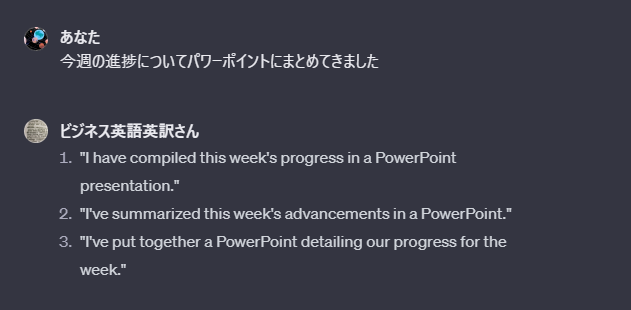

    
日本語を入力するとビジネスでの会話で使える形の英訳を複数提示します。作成したGPTsは<a target=”_blank” href="https://chat.openai.com/g/g-mImbsIcux-bizinesuying-yu-ying-yi-san">こちら</a>で公開しています。

## 入力例

### プレゼンテーションの練習

{}
発表は以上です
{}

{}
● "That concludes my presentation."
● "This marks the end of my presentation."
● "I have finished my presentation."
{}