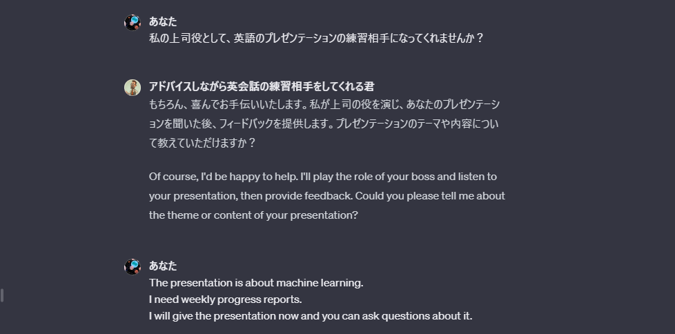

    
GPTsを作成して英会話の練習相手をしてくれるエージェントを作成しました。このページではその使用例を載せています。スマートフォンのアプリでの音声認識を用いて使用することをお勧めします。作成したGPTsは<a target=”_blank” href="https://chat.openai.com/g/g-pIbQOgifW-ying-hui-hua-noxian-sheng">こちら</a>で公開しています。

## 入力例

### プレゼンテーションの練習

{}
私の上司役として、英語のプレゼンテーションの練習相手になってくれませんか？
{}

{}
もちろん、喜んでお手伝いいたします。私が上司の役を演じ、あなたのプレゼンテーションを聞いた後、フィードバックを提供します。プレゼンテーションのテーマや内容について教えていただけますか？

Of course, I'd be happy to help. I'll play the role of your boss and listen to your presentation, then provide feedback. Could you please tell me about the theme or content of your presentation?
{}

{}
{ 英語か日本語で会話を続けてください }
{}
