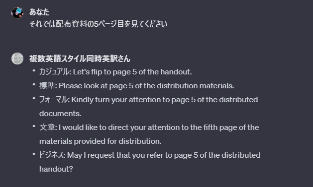

    
日本語をカジュアル・標準・フォーマル・文章体・ビジネス場面のスタイルの英文に同時英訳してくれるAIです。作成したGPTsは<a target=”_blank” href="https://chat.openai.com/g/g-PJYc6cJWs-fu-shu-ying-yu-sutairutong-shi-ying-yi-san">こちら</a>で公開しています。

## 入力例

### プレゼンテーションの練習

{}
スライドの２ページ目を見てください
{}

{}
● カジュアル: Please look at slide number two.
● 標準: Kindly turn to page two of the slide presentation.
● フォーマル: I request your attention on the second slide.
● 文章: May I direct your focus to the second page of the slide deck.
● ビジネス: Please refer to the second slide in the presentation.
{}