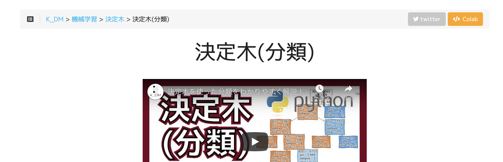

## はじめに

このサイトは私が勉強した内容をVlog・コードの形で書き残すページです。
2021年10月初めに公開して以降、データ分析に必要な処理や機械学習に関するトピックを中心にまとめています。

- 機械学習：アルゴリズムの仕組みや実際に動かしてみた系
- データ前処理：色々なデータのデータ加工/前処理について
- 評価指標：モデル選択やモデルの性能評価について
- 時系列：タイムスタンプと数値が合わさったデータについて

## コードの動かし方



{}
Google Colaboratory(Colab)はGoogleが提供するブラウザで動作するPython実行環境の名称であり、
環境構築なしで簡単にコードを実行して共有できるサービスです。利用にはGoogleアカウントが必要です。
各ページの右上にある<a href="#" class="btn colab-btn-border in-text-button">Colab</a>ボタンをクリックすると、そのページのコードをGoogle Colaboratory上で実行できます。



Colabについては「[Colaboratory よくある質問](https://research.google.com/colaboratory/faq.html?hl=ja)」などのページもご参照ください。

{}
{}

Anacondaで仮想環境を作成したのち、各コードで必要なライブラリ・パッケージをインストールしてください。
ただし、このサイトではAnacondaは一切使用していないので動作確認はしていない点ご了承ください。

```
conda create -n py38_env python=3.8
conda install ライブラリ名
```

{}
{}

[Poetry | Installation](https://python-poetry.org/docs/)に記載されている方法でpoetryをインストール後、`pyproject.toml` のファイルがある階層にて `poetry install` を実行してください。

{}
