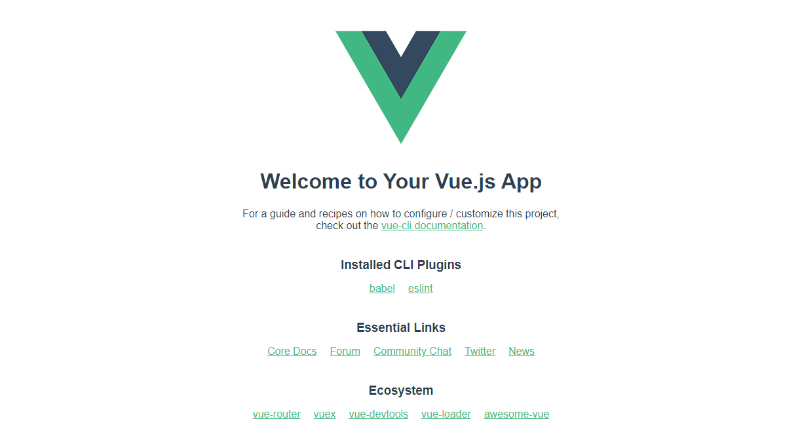
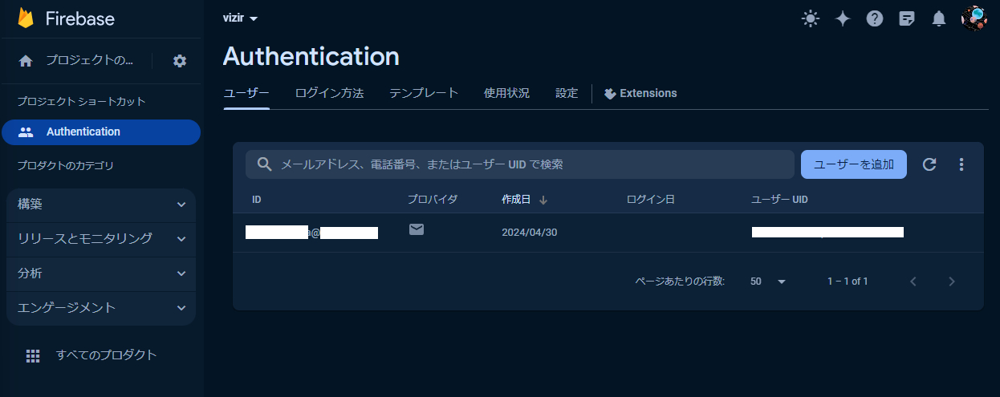
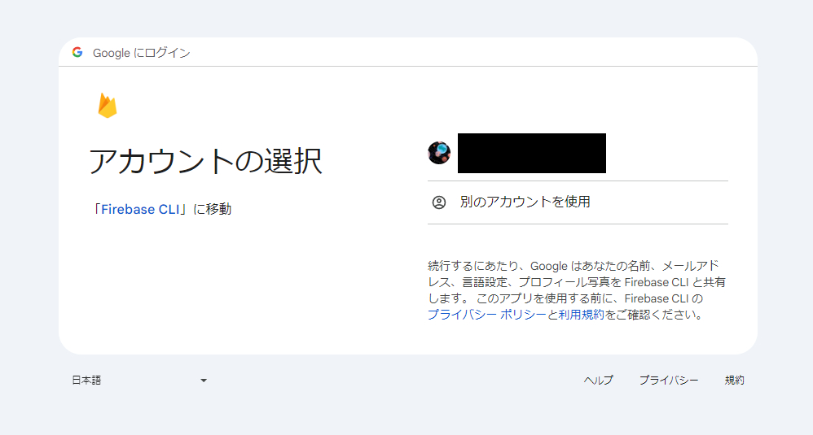

## Flask + Vue.js

### アプリの作り方

アプリケーションに以下の機能を実装します。ユーザーがある企業のコードや名前を入力すると、そのIRや関連企業を表示するようなアプリにします。以下のような機能を持つ想定にします。

- Googleアカウント等によるログイン機能
- 入力された企業のIR情報を確認する
- 入力された企業の関連企業の一覧を出す


#### Node.js

##### インストール

[こちら](https://nodejs.org/en)からインストールします。

#### Vue.jsのインストール

##### インストール

```
npm install --global @vue/cli
npm install --global firebase-tools
```

    74 packages are looking for funding
    run `npm fund` for details
    npm notice
    npm notice New minor version of npm available! 10.5.0 -> 10.6.0
    npm notice Changelog: https://github.com/npm/cli/releases/tag/v10.6.0
    npm notice Run npm install -g npm@10.6.0 to update!
    npm notice


##### Vueのプロジェクトを作成

```
vue create app
cd app
npm run serve
```

[http://localhost:8080/](http://localhost:8080/)にアクセスすると以下のような画面をブラウザで見ることができるはずです。




この状態で `vizir\app\src\App.vue` の文字を変更してみると、画面上の文字もリアルタイムで変更される（Hot Reloadが動作している）ことが確認できればokです！

#### ログイン機能




```
firebase login
```

`Allow Firebase to collect CLI and Emulator Suite usage and error reporting information? (Y/n)` の回答はどちらでもよいです。以下の画面に遷移するはずなので、先ほど登録したメールアドレスでログインをしてください。



firebaseのURLを見るとproject-idが分かります。『https://console.firebase.google.com/project/{project-id}/overview?hl=ja』というフォーマットになっています。